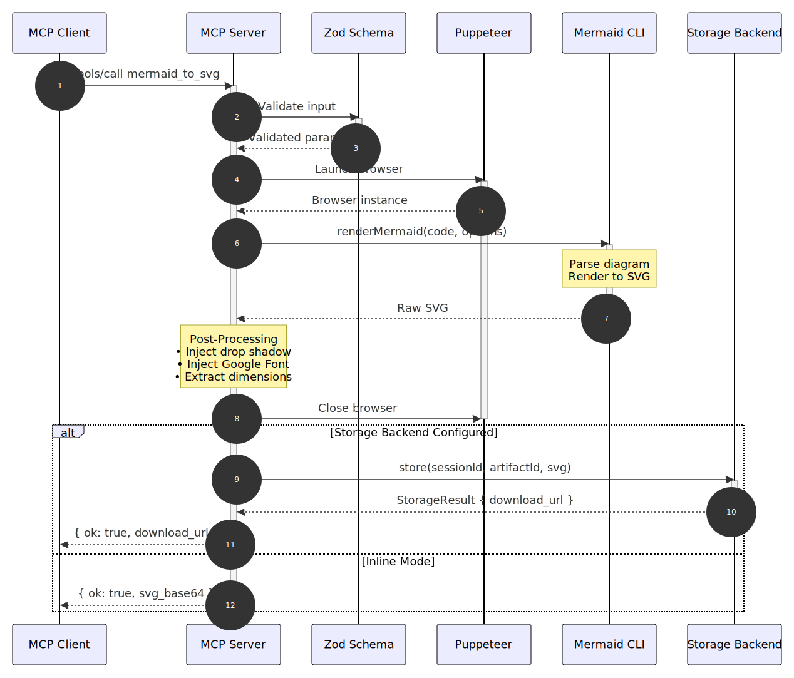

# Mermaid MCP Server

Model Context Protocol (MCP) server for rendering Mermaid diagrams to vector artifacts (SVG, PDF). Built with Puppeteer and the official Mermaid CLI for high-quality rendering with customizable themes, fonts, and styling.



## Features

- **High-Quality Rendering**: Puppeteer + Mermaid CLI with Google Fonts and drop shadow support
- **Multiple Output Formats**: SVG and PDF with configurable themes (`default`, `dark`, `forest`, `neutral`)
- **PDF Deck Builder**: Combine multiple diagrams into multi-page PDF presentations
- **Flexible Storage**: Local filesystem or S3/MinIO with automatic backend detection
- **Inline Mode**: Return base64-encoded artifacts when no storage is configured
- **Docker Ready**: Volume mount support for persistent artifact storage
- **MCP Compliant**: Full Model Context Protocol specification compliance

## Quick Start

### NPM Installation

```bash
# Install globally
npm install -g @fay-i/mermaid-mcp

# Run the MCP server with a data directory
mermaid-mcp ./data/artifacts

# Show help
mermaid-mcp --help
```

The server requires a data directory argument where generated SVG and PDF files will be stored. The directory will be created if it doesn't exist.

### Docker Compose (Recommended)

```bash
# Clone repository
git clone <repository-url>
cd mermaid-mcp

# Create local storage directory
mkdir -p ./data/artifacts

# Start with local storage (default)
docker-compose up -d

# Verify server is running
curl http://localhost:8000/health
```

### Local Development

```bash
# Install dependencies
npm install

# Build the project
npm run build

# Run with a data directory
node dist/index.js ./data/artifacts
```

## Configuration

### Local Storage (Default)

Local storage is configured via the required command-line argument:

```bash
mermaid-mcp /path/to/data/directory
```

Artifacts are stored as:
```
/path/to/data/directory/{session-uuid}/{artifact-uuid}.svg
/path/to/data/directory/{session-uuid}/{artifact-uuid}.pdf
```

### S3 Storage

For S3/MinIO storage, set `STORAGE_TYPE=s3` and provide credentials:

```bash
# S3 storage settings
STORAGE_TYPE=s3
S3_ENDPOINT=https://s3.amazonaws.com   # S3/MinIO endpoint URL
S3_BUCKET=my-bucket                    # S3 bucket name
AWS_ACCESS_KEY_ID=...                  # AWS access key
AWS_SECRET_ACCESS_KEY=...              # AWS secret key
AWS_REGION=us-east-1                   # AWS region (default: us-east-1)
```

When using S3, no data directory argument is needed:

```bash
STORAGE_TYPE=s3 S3_BUCKET=my-bucket ... mermaid-mcp
```

### Docker Compose Configuration

#### Local Storage (Default)

```yaml
services:
  mermaid-mcp:
    build: .
    volumes:
      - ./data/artifacts:/app/data/artifacts
```

#### S3 Storage

```yaml
services:
  mermaid-mcp:
    build: .
    environment:
      - STORAGE_TYPE=s3
      - MERMAID_S3_ENDPOINT=https://s3.amazonaws.com
      - MERMAID_S3_BUCKET=my-bucket
      - MERMAID_S3_ACCESS_KEY=${AWS_ACCESS_KEY_ID}
      - MERMAID_S3_SECRET_KEY=${AWS_SECRET_ACCESS_KEY}
      - AWS_REGION=us-east-1
```

#### Local MinIO for Testing

```bash
# Start with MinIO included
docker-compose --profile with-s3 up -d

# Configure MCP server to use MinIO
export STORAGE_TYPE=s3
export MERMAID_S3_ENDPOINT=http://localhost:9000
export MERMAID_S3_BUCKET=mermaid
export MERMAID_S3_ACCESS_KEY=minioadmin
export MERMAID_S3_SECRET_KEY=minioadmin
```

## MCP Tools

The server exposes four tools via the Model Context Protocol:



### healthcheck

Verify server health and connectivity.

```json
{
  "echo": "test"
}
```

**Response:**
```json
{
  "ok": true,
  "status": "healthy",
  "version": "0.1.0",
  "timestamp": "2026-01-07T12:00:00.000Z",
  "echo": "test"
}
```

### mermaid_to_svg

Render a Mermaid diagram to SVG format.

**Parameters:**

| Parameter | Type | Default | Description |
|-----------|------|---------|-------------|
| `code` | string | *required* | Mermaid source code (1-1MB) |
| `theme` | enum | `"default"` | `default`, `dark`, `forest`, `neutral` |
| `background` | string | `"#ffffff"` | CSS background color |
| `config_json` | string | - | Advanced Mermaid configuration |
| `timeout_ms` | number | `30000` | Render timeout (1000-120000ms) |
| `drop_shadow` | boolean | `true` | Apply drop shadow styling |
| `google_font` | string | `"Source Code Pro"` | Custom Google Font |

**Example:**
```json
{
  "code": "flowchart LR\n    A[Start] --> B[End]",
  "theme": "default",
  "drop_shadow": true
}
```

**Response (with storage):**
```json
{
  "ok": true,
  "request_id": "550e8400-e29b-41d4-a716-446655440000",
  "artifact_id": "7f3d2c1b-4a5e-6f7d-8c9b-0a1b2c3d4e5f",
  "download_url": "file://data/artifacts/session-uuid/artifact-uuid.svg",
  "content_type": "image/svg+xml",
  "size_bytes": 12345,
  "storage_type": "local"
}
```

### mermaid_to_pdf

Render a Mermaid diagram to PDF format. Same parameters as `mermaid_to_svg`.

**Timeout Budget:**
- SVG rendering: 80% of `timeout_ms`
- PDF generation: 20% of `timeout_ms`

```json
{
  "code": "sequenceDiagram\n    Alice->>Bob: Hello",
  "theme": "neutral"
}
```

### mermaid_to_deck

Combine multiple Mermaid diagrams into a multi-page PDF presentation.

**Additional Parameters:**

| Parameter | Type | Default | Description |
|-----------|------|---------|-------------|
| `diagrams` | array | *required* | 1-100 diagrams with `code` and optional `title` |
| `page_size` | enum | `"letter"` | `letter`, `a4`, `legal` |
| `orientation` | enum | `"landscape"` | `landscape`, `portrait` |
| `show_titles` | boolean | `true` | Display diagram titles |
| `margins` | object | `{top: 36, ...}` | Page margins in points |

**Example:**
```json
{
  "diagrams": [
    {"code": "flowchart LR\n    A-->B", "title": "Architecture"},
    {"code": "sequenceDiagram\n    A->>B: Request", "title": "Sequence"}
  ],
  "page_size": "letter",
  "orientation": "landscape"
}
```

## Rendering Pipeline



### Post-Processing Features

**Drop Shadow Filter:** Adds subtle depth to diagram elements for better visual appearance.

**Google Font Injection:** Embeds custom fonts for consistent typography across different viewing environments.

**GitHub Light Theme:** Default theme uses GitHub-inspired colors for a clean, professional look.

## Storage System

The server uses a pluggable storage backend architecture:



### Storage Backend Selection



## Storage Behavior

### Local Storage

- **Path Structure**: `{LOCAL_STORAGE_PATH}/{session_id}/{artifact_id}.{ext}`
- **URL Format**: `file://{HOST_STORAGE_PATH}/{session_id}/{artifact_id}.{ext}`
- **Persistence**: Artifacts persist indefinitely (manual cleanup required)
- **Atomic Writes**: Temp file + rename pattern prevents partial files
- **Startup Cleanup**: Orphaned `.tmp` files removed on server start

### S3 Storage

- **Key Format**: `{artifact_id}.{ext}` (flat structure, no session prefix)
- **URL Format**: Presigned HTTPS URLs with configurable expiration
- **Compatibility**: Works with AWS S3, MinIO, and other S3-compatible services
- **Backward Compatible**: All existing S3 deployments continue to work unchanged

## Troubleshooting

### "Permission denied" on startup

**Problem**: Container cannot write to mounted volume.

**Solution**:
```bash
# Fix directory permissions on host
chmod 755 ./data/artifacts

# Or run container with matching UID/GID
docker run --user $(id -u):$(id -g) ...
```

### "file:// URL not accessible"

**Problem**: File URLs only work on the same machine as the storage.

**Solution**:
```bash
# Option 1: Use HTTP URLs via CDN proxy
export LOCAL_URL_SCHEME=http
export CDN_HOST=mermaid-svc
export CDN_PORT=3001

# Option 2: Ensure HOST_STORAGE_PATH matches actual host mount point
export HOST_STORAGE_PATH=/absolute/path/on/host
```

### "Configuration error: ambiguous storage"

**Problem**: Auto-detection failed because both local path and S3 credentials are configured.

**Solution**:
```bash
# Explicitly choose storage backend
export STORAGE_TYPE=local  # or STORAGE_TYPE=s3
```

### Disk full errors

**Problem**: Local storage ran out of disk space.

**Solution**:
```bash
# Check disk usage
df -h /app/data/artifacts

# Remove old artifacts manually
find /app/data/artifacts -name "*.svg" -mtime +30 -delete
```

### S3 connection errors

**Problem**: Cannot connect to S3/MinIO endpoint.

**Solution**:
```bash
# Verify S3 credentials
aws s3 ls s3://${MERMAID_S3_BUCKET} --endpoint-url=${MERMAID_S3_ENDPOINT}

# Check network connectivity
curl -v ${MERMAID_S3_ENDPOINT}

# Verify environment variables are set correctly
env | grep MERMAID_S3
```

## Development

### Running Tests

```bash
# Run all quality checks
npm run quality

# Run unit tests only
npm run test

# Run integration tests only
npm run test:integration

# Type checking
npm run typecheck

# Linting
npm run lint

# Format check
npm run format:check
```

### Clean Slate Protocol

Before every commit/push, run the full quality gate from a clean state:

```bash
# Clean build artifacts
npm run clean

# Fresh dependency install
rm -rf node_modules && npm install

# Run all quality checks
npm run quality
```

## Architecture

The server follows a modular architecture with clear separation of concerns:


### Request Lifecycle



### Deck Assembly Pipeline


### Source Code Structure

```
src/
├── index.ts              # MCP server entry point
├── version.ts            # Version constant
├── tools/                # Tool implementations
│   ├── healthcheck.ts
│   ├── mermaid-to-svg.ts
│   ├── mermaid-to-pdf.ts
│   └── mermaid-to-deck.ts
├── renderer/             # Rendering engine
│   ├── browser.ts        # Puppeteer lifecycle
│   ├── render.ts         # Mermaid → SVG
│   └── deck-assembler.ts # PDF merging (pdf-lib)
├── storage/              # Storage backends
│   ├── factory.ts        # Backend factory
│   ├── local-backend.ts  # Local filesystem
│   └── s3-backend.ts     # S3/MinIO
└── schemas/              # Zod validation schemas
    ├── mermaid-to-svg.ts
    ├── mermaid-to-pdf.ts
    └── mermaid-to-deck.ts
```

### Error Codes

| Code | Description |
|------|-------------|
| `INVALID_INPUT` | Empty or malformed input |
| `INPUT_TOO_LARGE` | Exceeds 1MB size limit |
| `PARSE_ERROR` | Mermaid syntax error |
| `RENDER_TIMEOUT` | Exceeded timeout budget |
| `RENDER_FAILED` | Browser/Puppeteer error |
| `PDF_GENERATION_FAILED` | PDF conversion error |
| `STORAGE_ERROR` | Storage backend failure |

## Requirements

- Node.js 24+
- Docker 24+ (for containerized deployment)
- Chromium (bundled in Docker image)

## Documentation

- [Architecture Overview](docs/architecture/README.md) - Detailed system architecture
- [MCP Specification](https://modelcontextprotocol.io/) - Model Context Protocol docs
- [Mermaid Documentation](https://mermaid.js.org/) - Mermaid diagram syntax

## License

MIT - See [LICENSE](LICENSE) file for details.

## Contributing

1. Follow TDD practices (tests before implementation)
2. Run `npm run quality` before every commit
3. One PR per user story
4. No skips, ignores, or bypasses in tests or linting
5. See [AGENTS.md](AGENTS.md) for AI agent guidelines
